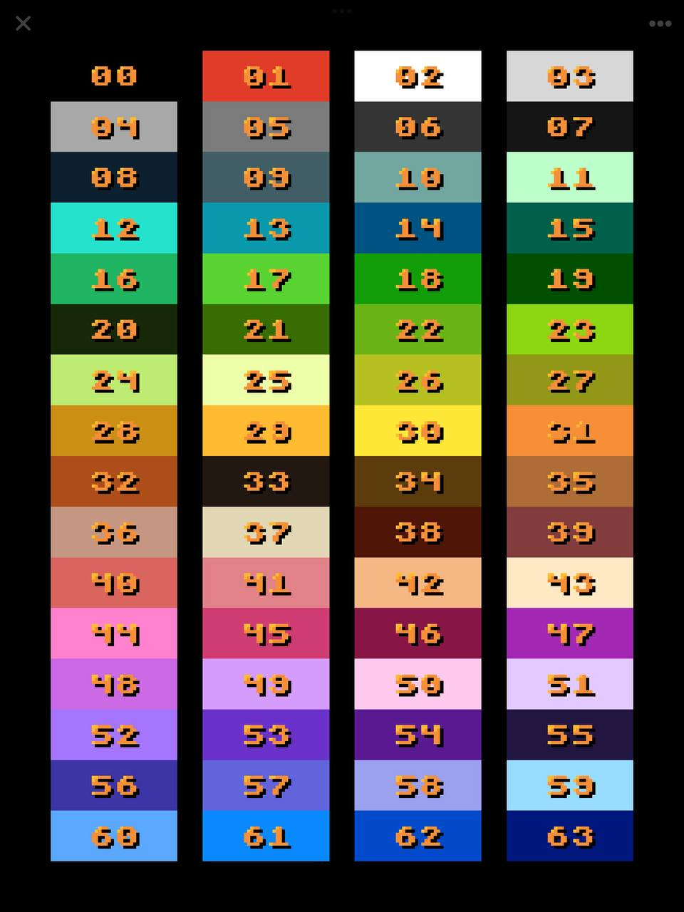
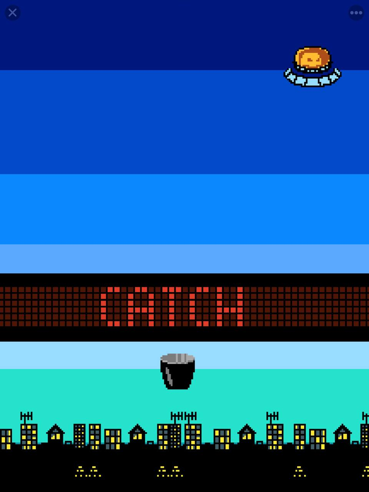

> This is a fork of the excellent fantasy console LowRes NX by Timo "Inutilis" Kloss.
> This is a heavily modified version and way more complicated to use, I recommend you to stay on the original app: [LowRes NX Coder on App Store](https://apps.apple.com/app/lowres-nx-coder/id1318884577).

Create your games and play it on the go using an iPhone or iPad. LowResRMX is a virtual game console and a game development environment that include all the tools to start and finish a project.

It _will_ include a project manager, a code editor and some tools to edit game assets: sprites, palettes, backgrounds, instruments and musics.

### Goal

I want to be able to create games on the go using my iPad and eventually, put them on the App Store for free. LowRes NX can do that but come with limitation that remove appealing, like no fullscreen, and no fine touch detection.

- [x] Bigger draw surface
- [x] Not EGA color palette
- [ ] Usable iOS app
- [ ] Documentation
- [ ] Good enough compatibility mode
- [ ] Integrated graphics editor
- [ ] Integrated sound editor

### Tested environment

1. Ubuntu 💚

    - Ubuntu 22.04.2 LTS
    - Clang 14.0
    - Cmake 3.22
    - Visual Studio Code 1.82
        - CMake Tools extension 1.15

2. WSL on Windows 10 🤦‍♂️

    - Windows 10.0.19045
    - WSL 1.2.5

3. Windows 10 💚

    - Windows 10 Home 22H2 19045
    - Visual Studio Community 2019 x86
    - Cmake 3.27
    - Visual Studio Code 1.82
        - CMake Tools extension 1.15

4. iPad mini 4 💚

    - Ventura 13.4
    - Xcode 14.3

